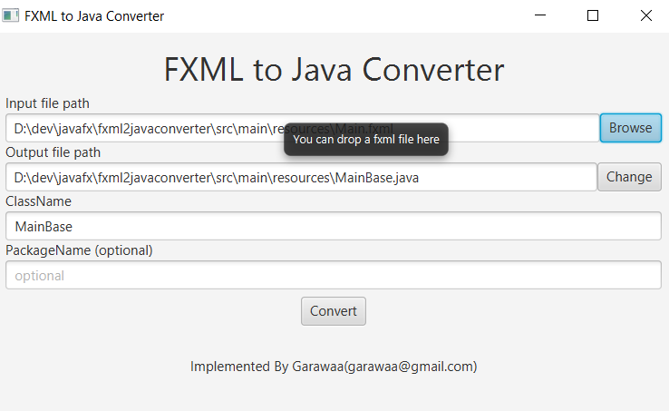
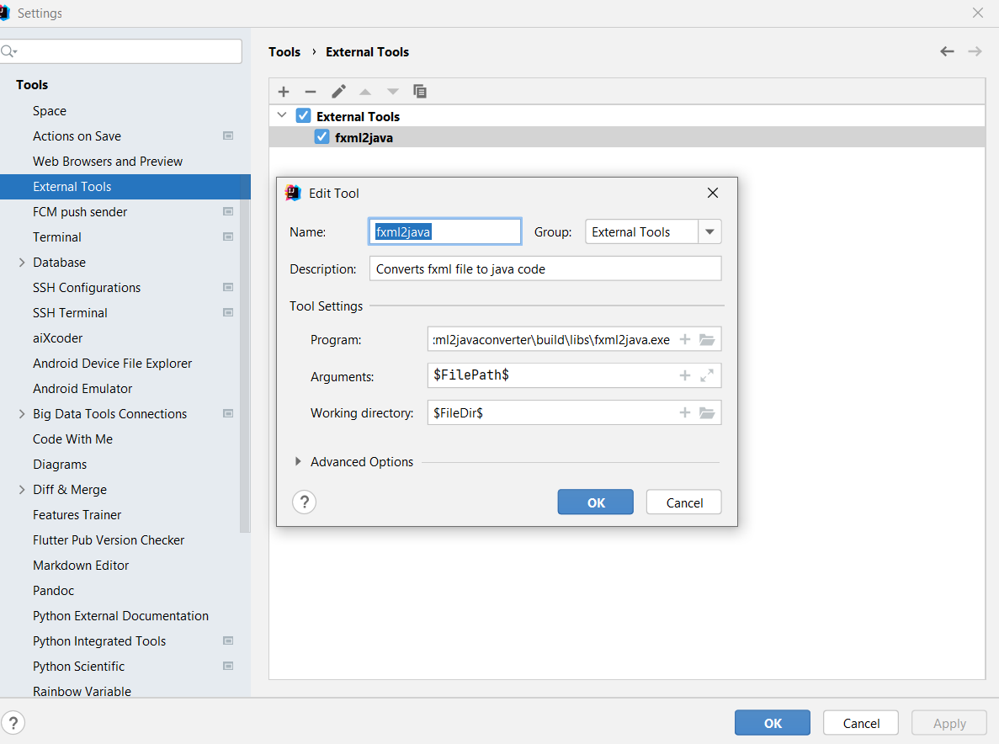

# fxml2javaconverter
Simple fxml to java code converter. You can drag a fxml file from file explorer to input text field or browse a fxml file and adjust some output path, class name, package name as you needed. Then click convert button. 
## Command line run
fxml2java.exe [path/to/fxmlfilename] 
or
java -jar fxml2java.jar [path/to/fxmlfilename]
# Main window screenshot

# Intellij external tool setting

After adding external tool setting you can convert a fxml file to java code from context menu in intellij ide. You can add this tools to other IDEs as external command similarly.
# Usage
After generating a java base class, just create a java class by extending generated base class and use it as normal ui class. For example see it's source code.
# Build source code
It is gradle based project. Just open this project in your favorite java IDE like vscode, eclipse, netbeans, intellij idea and run application task. If you want to use proguard then just run proguard task. I used intellij IDE and java8 for development.
